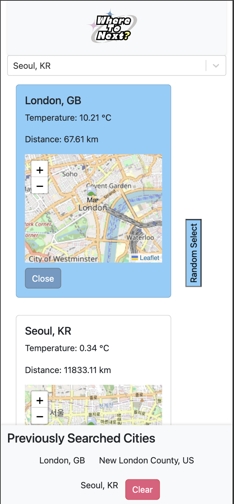
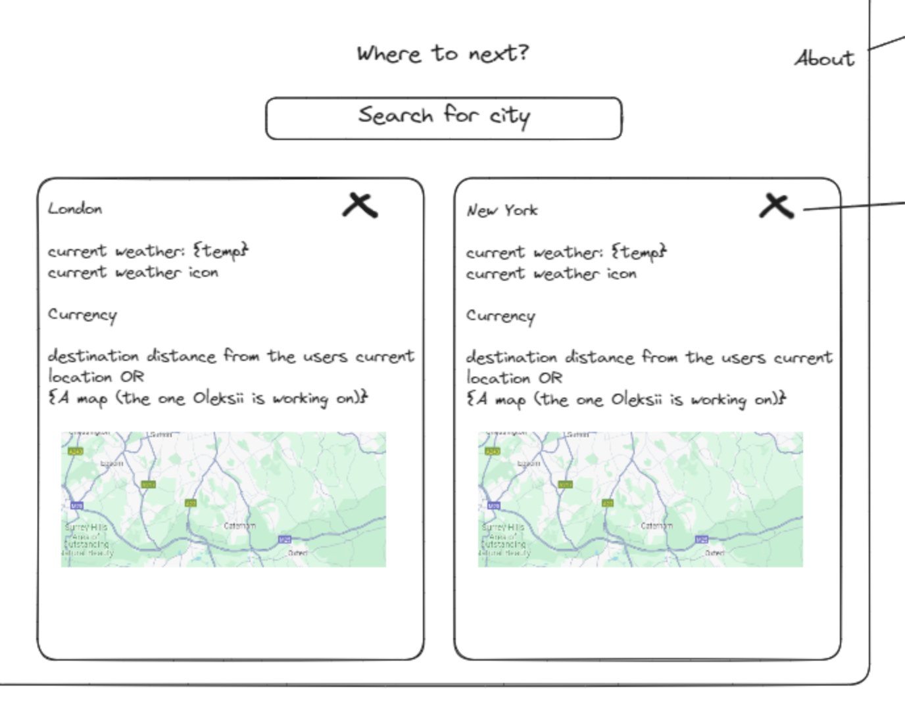

# Where to Next?


## Overview

**Where to Next?** is a sophisticated travel application designed for those with a passion for exploration. Discover your next vacation destination with ease, accessing a wealth of information including real-time weather conditions, geographical insights, comparative distances, and currency exchange rates against GBP. Our project leverages the robustness of React and Node.js to ensure a seamless, mobile-friendly user experience, enabling informed decision-making tailored to your personal preferences.

## Key Features

- **Comprehensive City Comparisons**: Input any number of cities for a detailed comparison.
- **Real-Time Weather Conditions**: Stay updated with the latest weather forecasts.
- **Current Currency Exchange Rates**: Compare foreign currencies against the GBP.
- **Interactive Maps**: Explore the location of your next potential visit in an interactive format.
- **Distance Calculations**: Find out how far each city is from your current location.
- **Random City Selection**: Feeling adventurous? Let our app choose your next destination at random.
- **User-Friendly Design**: Navigate our app with ease on any device.
- **Persistent Search History**: Revisit your past searches anytime, powered by local storage.

## Technology Stack

- **Frontend**: Developed using React, enhanced with npmjs packages and Material-UI components.
- **Backend**: Built on Node.js, integrating various APIs for comprehensive data retrieval.
- **APIs**:
  - Weather Data: [Open Weather API](https://openweathermap.org/api)
  - Currency Exchange Rates: [Exchange Rate API](https://www.exchangerate-api.com/)
  - City Information: [GeoDB Cities](https://rapidapi.com/wirefreethought/api/geodb-cities)
- **Styling**: Crafted with Bootstrap and custom CSS for a sleek, responsive design.

## Getting Started

### Installation

1. **Clone the repository**:
   ```bash
   git clone https://github.com/leeathena/where-to-next.git


## Navigate to the project directory

- cd where-to-next

## Install the dependencies

- npm install

## Start the development server:

- npm run dev

- Open http://localhost:3000 in your browser to view the application.

## Usage

- Start by searching for a city in the search bar.

- View the location, weather and currency data fetched from external APIs.

- Review your search history and clear it if needed.

- Use the "Random Select" button to pick a random city from your search results.

## Team

- Sandesh: Repo structure and README.

- Temi & Amarjit: HTML/CSS/Bootstrap.

- Oleksii & Athena: API integration and Context API.

- Sandesh, Amarjit, Athena: JavaScript Development.

## License

- This project is open-sourced under the MIT License. See the LICENSE file for more details.

## Screenshots (Website and Wireframe)





## Netlify

- [Checkout our website] https://where-to-next-9.netlify.app/
